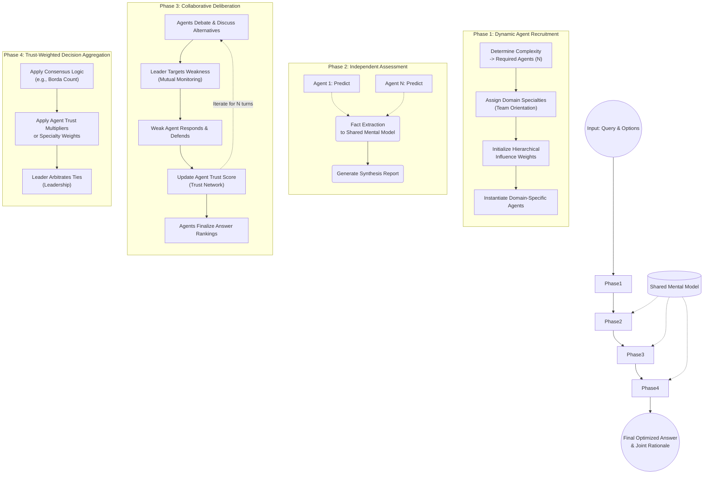

# TeamMedAgents: Multi-Agent Workflow and Algorithmic Design

## Overview
TeamMedAgents is a collaborative, modular multi-agent framework designed to emulate human expert team dynamics in complex domain-specific tasks (e.g., medical diagnostics). The architecture models teamwork through five distinct, toggleable cognitive components—Shared Mental Model, Leadership, Team Orientation, Trust Network, and Mutual Monitoring—that augment agents through four operational phases.

The system dynamically adapts to the structural complexity of a given input query, determining the optimal number of agents and their specialized domain expertise before orchestrating an independent assessment phase, a multi-turn collaborative deliberation, and a final weighted consensus mechanism.

---

## 1. System Input and Dynamic Agent Recruitment (Phase 1)

**Input Definition:**
The workflow begins with a complex query ($Q$), a set of candidate answers ($\mathcal{A}$), and a modular configuration profile ($\mathcal{C}$) specifying which teamwork components are active.

**Dynamic Recruitment Mechanism:**
Instead of a static ensemble, the system evaluates the query's complexity to recruit an on-demand expert board.

- **Determine Agent Count:** An initial heuristic assesses domain breadth and diagnostic depth requirements to dynamically spin up an optimal number of agents ($N$, typically 2-4).
- **Determine Domain Specialties (Team Orientation):** The system maps the query to required sub-specialties (e.g., Cardiology, Pathology). It then instantiates agents with highly specific, non-overlapping persona templates aligned to those domains. 
- **Hierarchical Weighting:** In specialized teams, agents are assigned unequal influence weights (e.g., $\mathcal{W} = [0.5, 0.3, 0.2]$ for $N=3$), prioritizing the primary domain expert over secondary consultants.

---

## 2. Independent Assessment (Phase 2)

Before collaborating, agents form unbiased initial predictions. 

- **Parallel Evaluation:** Each dynamically spawned agent receives the input context alongside their specific role instructions and independently acts to predict the correct answer.
- **Fact Extraction (Shared Mental Model):** Verified facts and analytical points are synthesized from each agent's individual prediction to seed the **Shared Mental Model**, bridging the cognitive gap before deliberation begins.
- **Initial Scoring (Trust Network):** Trust scores ($\mathcal{T}$) are initialized identically (e.g., 0.8) and subsequently subjected to a preliminary evaluation based on the quality of each agent's initial rationale.

---

## 3. Collaborative Deliberation (Phase 3)

In this multi-turn discussion phase, the agents converge, sharing reasoning and critiquing divergent paths.

- **Context Integration:** Agents receive the compiled predictions from their peers, any reports generated thus far, and facts stored in the Shared Mental Model.
- **Discussion Iterations:** Agents evaluate peers' logic and iteratively refine their own stance over a fixed number of turns ($n_{turns}$).
- **Targeted Critique (Mutual Monitoring):** A critical error-checking mechanism operates during discourse. The Leader explicitly targets the weakest reasoning string in the pool, raises a pointed concern, forces the targeted agent to defend or correct their stance, and logs the debate.
- **Trust Recalibration:** Based on the robustness of the agent's response to the targeted critique, their internal trust score is updated dynamically via an exponential moving average. 
- **Final Ranking:** At the end of the final discussion turn, each agent outputs a ranked preference of the candidate answers alongside their final rationale.

---

## 4. Trust-Weighted Decision Aggregation (Phase 4)

The collaborative results are funneled into a mathematically rigorous voting layer to guarantee consensus.

- **Aggregation Method:** The final ranked lists from all agents are mathematically processed using a rank-aware metric like the Borda count mechanism.
- **Weighted Influence:**
  - If **Trust Network** is enabled, the Borda scores are strictly multiplied by each agent's accrued Trust Score. 
  - If **Team Orientation** is enabled (without Trust), the static hierarchical domain weights $\mathcal{W}$ govern the vote.
  - If neither is enabled, an equal-weight Standard Borda handles the aggregation.
- **Tie-Breaking:** If multiple answers tie, the Leader agent reviews the discussion history, the Shared Mental Model artifacts, and the trust scores to authoritatively break the tie.
- **Output:** The system returns the absolute best prediction $\hat{A}$ alongside a unified, step-by-step generated rationale.

---

## The "Big Five" Teamwork Components

1. **Shared Mental Model (SMM)** 
   Acts as a highly synchronized, transient memory drive. It actively tracks "verified facts", query "tricks", and "monitored debates," injecting them directly into the context windows of all agents so they reason from identical factual footing.

2. **Leadership**
   Spawns an agent whose explicit dual role is to orchestrate. The Leader recruits the team, generates synthesis reports aggregating all independent predictions, mediates disputes during deliberation, explicitly probes weak arguments, and assumes ultimate authority in edge-case tie-breaking.

3. **Team Orientation**
   Focuses on the heterogeneous division of labor. Eliminates redundant overlap by forcing agents to assume distinct semantic roles (Specialties) and structuring the team hierarchy (Weights) so the most relevant specialist inherently drives the conversation.

4. **Trust Network**
   Enables active meritocracy within the system. Agents begin as equals, but the continuous evaluation of their outputs strictly scales their numerical influence over the final prediction. Flawed reasoning results in statistically diminished voting power.

5. **Mutual Monitoring**
   Models psychological safety and peer review. Forces active adversarial critique by mathematically isolating the weakest link in the reasoning chain, initiating a forced challenge-response sequence to rapidly identify hallucinations or logical flaws.

---

## Abstract Algorithm Flowchart

